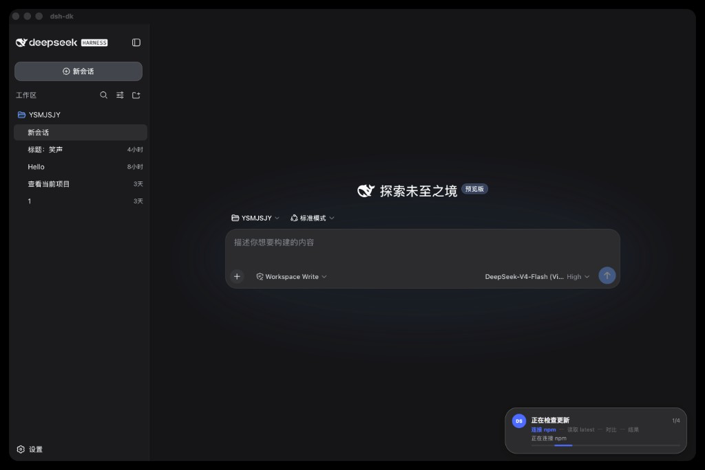
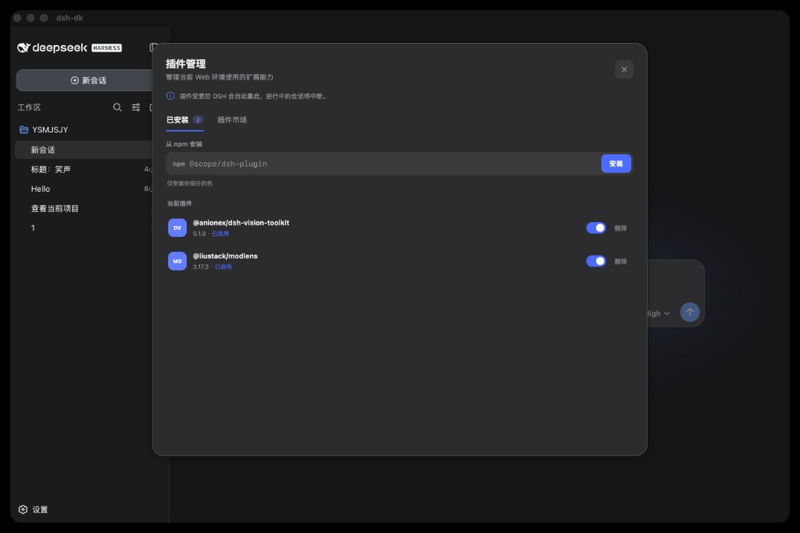
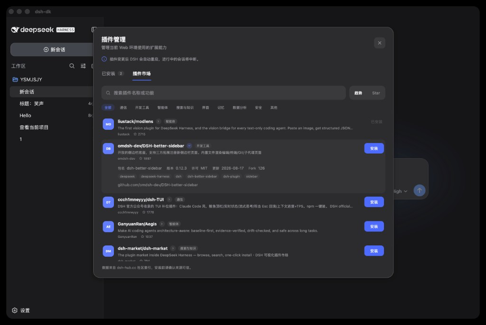
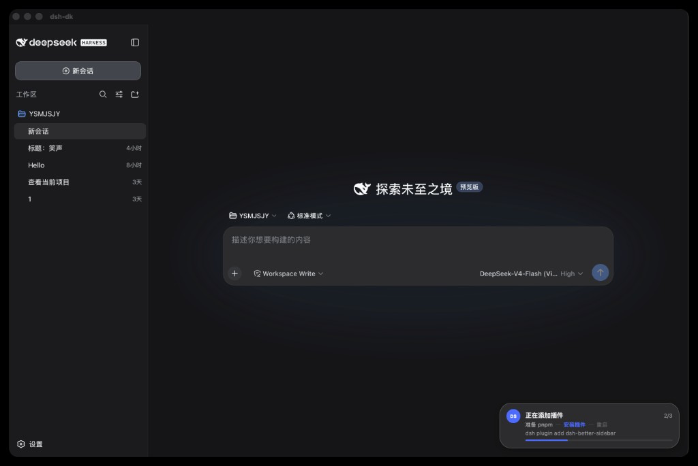

# DeepSeek Harness Desktop

DeepSeek Harness 的 Tauri 2 桌面壳。

项目不包含、不复制、不修改 `deepseek-ai/deepseek-harness` 源码。开发模式启动固定版本的官方 npm 包：

```sh
npx --yes @deepseek-ai/dsh@0.1.0-rc.6 web
```

桌面端只负责进程生命周期、窗口和后续原生能力。Agent、会话、工具和 Web UI 继续由官方 DSH 提供。

## 界面预览

### 主界面

官方 Web UI 由桌面壳托管。应用菜单可检查 npm `@deepseek-ai/dsh` 的 `latest`，进度显示在右下角 toast。



### 对话与工具调用


### 会话轨迹


### Agent 预设


### 插件配置


### 插件列表


### 插件管理

应用菜单 **插件** 打开独立管理窗口，可查看已安装包、启用 / 停用、删除，或按 npm 包名安装。变更后 DSH 会自动重启，进行中的会话会中断。



### 插件市场

市场页读取 [dsh-hub.cc](https://dsh-hub.cc) 社区索引（`scope=verified`），支持搜索、分类与排序。目录来自社区，不是官方商店；安装前请确认来源可信。实际安装仍走官方 `dsh plugin add <npm-spec>`。



### 安装插件

添加插件时 toast 展示步骤：准备 pnpm → 安装插件 → 重启。



## 开发

要求：

- Node.js
- Rust
- macOS、Windows 或 Linux 的 Tauri 2 系统依赖

```sh
npm install
npm run prepare:runtime
npm run dev
```

`prepare:runtime` 下载并校验一次固定 Node.js 和 DSH 运行时。后续开发启动直接使用该目录，不重复复制运行时；缺少该目录时才回退到系统 `npx`。开发版与发行版使用隔离的数据目录，均不向仓库写入 DSH 用户数据。

## 发行构建

```sh
npm run build
```

发行构建会下载并校验 Node.js 22.23.2，在独立目录安装锁定的官方 `@deepseek-ai/dsh@0.1.0-rc.6`，再将两者放入安装包。生成的运行时目录已被 Git 忽略。应用菜单可以检查 npm `@deepseek-ai/dsh` 的 `latest` 并安装到用户数据目录，不会改安装包。随包版本可随时恢复。应用菜单也可以检查 GitHub Releases 上的桌面更新并安装重启。

推送与应用版本一致的标签会触发 GitHub Actions：

```sh
git tag v0.1.9
git push origin v0.1.9
```

流水线发布 macOS Apple Silicon、macOS Intel、Windows x64 和 Linux x64 安装包，并上传 updater 产物与 `latest.json`。应用内更新使用仓库 updater 密钥验签。当前安装包没有商业代码签名，macOS Gatekeeper 和 Windows SmartScreen 可能显示未知开发者提示。发布前需要配置 GitHub Actions secret `TAURI_SIGNING_PRIVATE_KEY`（可选 `TAURI_SIGNING_PRIVATE_KEY_PASSWORD`）。

可用于本地诊断的环境变量：

| 变量 | 用途 |
| --- | --- |
| `DSH_DESKTOP_NPX` | 指定 `npx` 可执行文件路径 |
| `DSH_DESKTOP_PACKAGE` | 覆盖 DSH npm spec，仅用于兼容性测试 |
| `DSH_DESKTOP_WORKSPACE` | 覆盖初始 workspace |
| `DSH_DESKTOP_STARTUP_TIMEOUT_SECS` | 覆盖启动超时 |
| `DSH_DESKTOP_DISABLE_PLUGIN` | 设为非空值时不加载桌面桥接插件 |
| `DSH_DESKTOP_NPM` | 指定 `npm` 可执行文件路径 |
| `DSH_DESKTOP_NPM_REGISTRY` | 覆盖 npm registry，仅使用该地址查询和安装 latest |
| `DSH_DESKTOP_UPDATE_PROXY` | 覆盖桌面更新代理，例如 `http://127.0.0.1:7890`；未设时先看 `HTTPS_PROXY` / `HTTP_PROXY` / `ALL_PROXY`，再自动读系统 HTTPS/HTTP 代理 |

应用菜单可检查并安装桌面更新。**DSH** 提供检查 sidecar 更新、安装并重启、恢复随包版本。**插件** 提供插件管理（已安装 / 市场、npm 安装、启用停用、删除）。官方 Web UI 不能触发这些操作。

架构与发行约束见 [docs/architecture.md](docs/architecture.md)。
