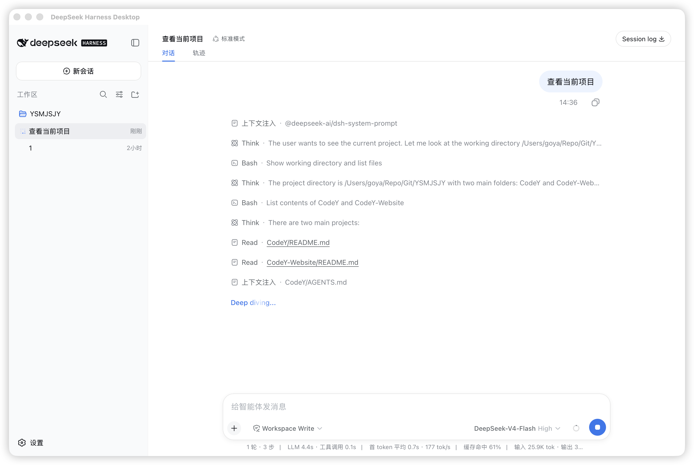
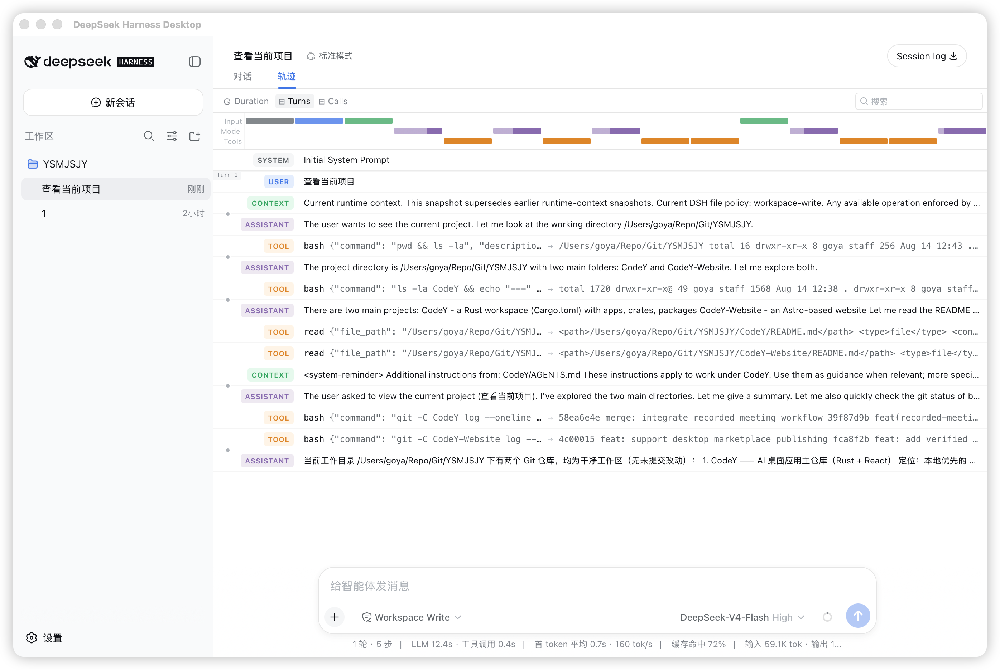
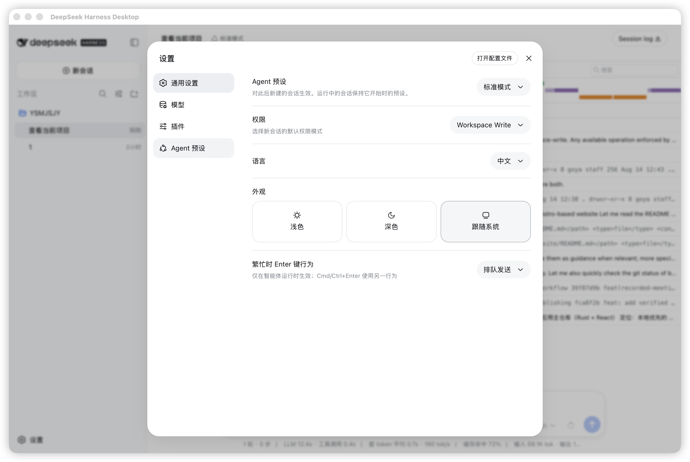
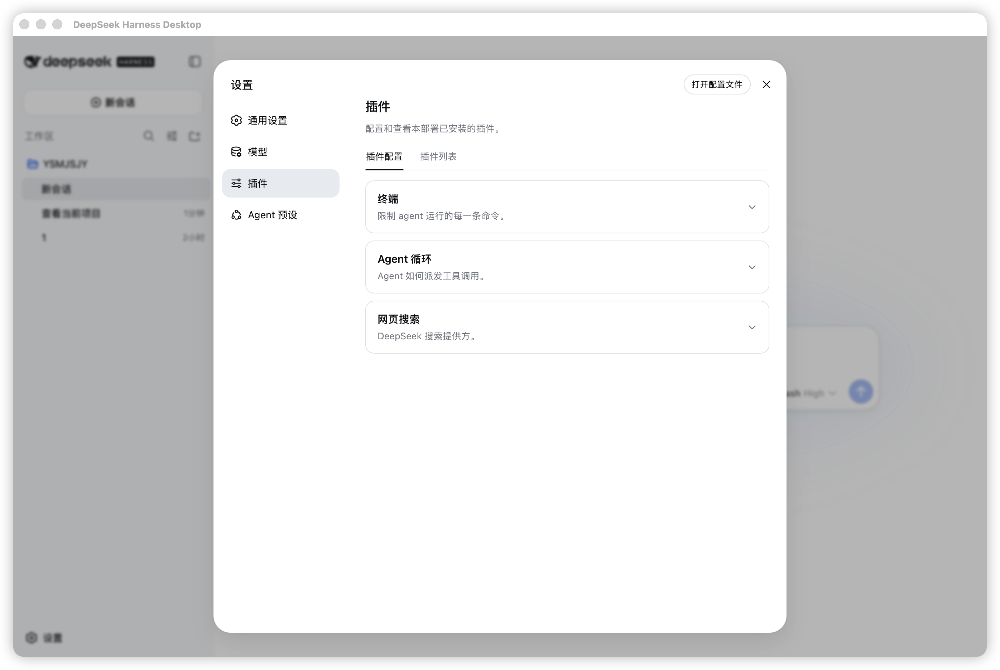
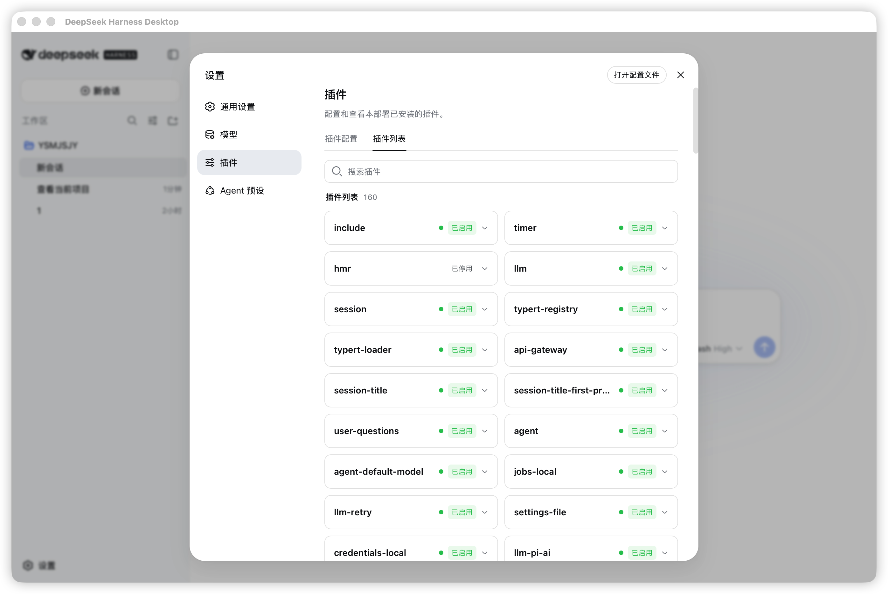

# DeepSeek Harness Desktop

DeepSeek Harness 的 Tauri 2 桌面壳。

项目不包含、不复制、不修改 `deepseek-ai/deepseek-harness` 源码。开发模式启动固定版本的官方 npm 包：

```sh
npx --yes @deepseek-ai/dsh@0.1.0-rc.6 web
```

桌面端只负责进程生命周期、窗口和后续原生能力。Agent、会话、工具和 Web UI 继续由官方 DSH 提供。

## 界面预览

### 对话与工具调用



### 会话轨迹



### Agent 预设



### 插件配置



### 插件列表



## 开发

要求：

- Node.js
- Rust
- macOS、Windows 或 Linux 的 Tauri 2 系统依赖

```sh
npm install
npm run prepare:runtime
npm run dev
```

`prepare:runtime` 下载并校验一次固定 Node.js 和 DSH 运行时。后续开发启动直接使用该目录，不重复复制运行时；缺少该目录时才回退到系统 `npx`。开发版与发行版使用隔离的数据目录，均不向仓库写入 DSH 用户数据。

## 发行构建

```sh
npm run build
```

发行构建会下载并校验 Node.js 22.23.2，在独立目录安装锁定的官方 `@deepseek-ai/dsh@0.1.0-rc.6`，再将两者放入安装包。生成的运行时目录已被 Git 忽略。

推送与应用版本一致的标签会触发 GitHub Actions：

```sh
git tag v0.1.4
git push origin v0.1.4
```

流水线发布 macOS Apple Silicon、macOS Intel、Windows x64 和 Linux x64 安装包。当前安装包没有商业代码签名，macOS Gatekeeper 和 Windows SmartScreen 可能显示未知开发者提示。

可用于本地诊断的环境变量：

| 变量 | 用途 |
| --- | --- |
| `DSH_DESKTOP_NPX` | 指定 `npx` 可执行文件路径 |
| `DSH_DESKTOP_PACKAGE` | 覆盖 DSH npm spec，仅用于兼容性测试 |
| `DSH_DESKTOP_WORKSPACE` | 覆盖初始 workspace |
| `DSH_DESKTOP_STARTUP_TIMEOUT_SECS` | 覆盖启动超时 |
| `DSH_DESKTOP_DISABLE_PLUGIN` | 设为非空值时不加载桌面桥接插件 |

架构与发行约束见 [docs/architecture.md](docs/architecture.md)。
