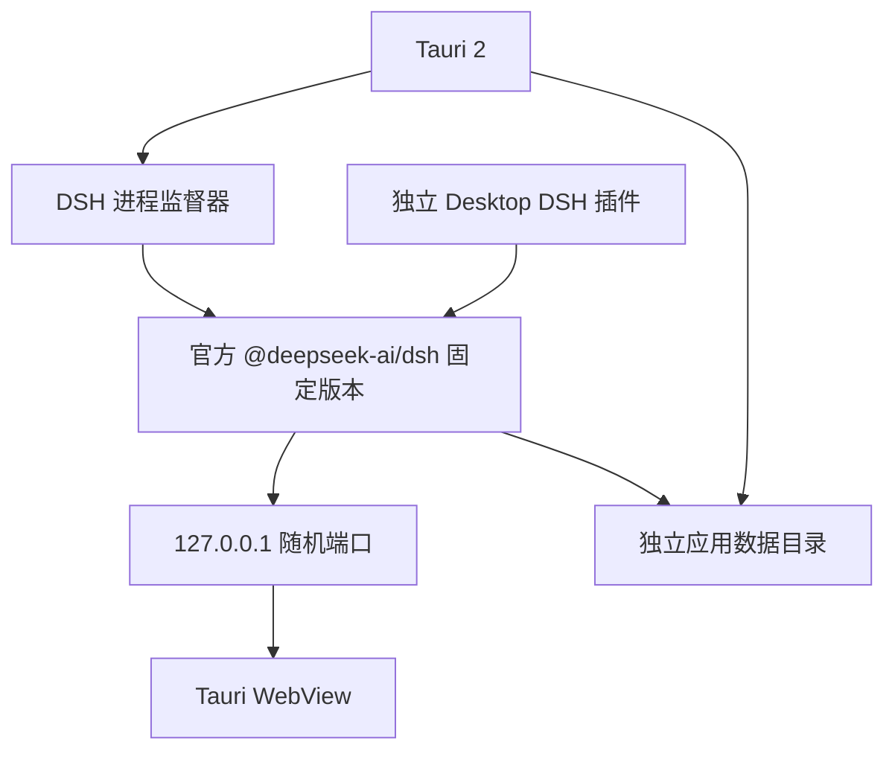

# 架构

## 不变量

1. 不 fork、不修改、不重新编译 `deepseek-ai/deepseek-harness` 源码。
2. DSH 运行时来自官方 `@deepseek-ai/dsh` npm 发布物。
3. 每个桌面版本固定一个 DSH 精确版本，不跟随 `latest`。
4. 新的 Agent 能力通过独立 DSH 插件接入。
5. 窗口、托盘、更新、Keychain 等操作系统能力由 Tauri 提供。

当前固定版本为 `@deepseek-ai/dsh@0.1.0-rc.6`。

## 运行结构



Tauri 启动 DSH 后轮询本地 HTTP 服务。服务可用时，主 WebView 从内置启动页导航到官方 Web UI。DSH 意外退出时，WebView 返回内置错误页，保留最近的子进程日志并允许重启。

主窗口默认隐藏。只有官方 Web UI 完成页面加载后才显示；内置页面只在启动失败或运行时退出时作为恢复界面出现。第二次启动由 Tauri 单实例插件转交给已有实例，不会再创建一套 DSH 进程。

## 开发与发行

开发模式优先使用准备好的本地运行时。缺少本地运行时时，回退命令为：

```sh
npx --yes @deepseek-ai/dsh@0.1.0-rc.6 web \
  --patch <generated-desktop-patch> \
  --host 127.0.0.1 \
  --port <available-port>
```

本地已经执行过 `npm run prepare:runtime` 时，开发模式优先直接使用 `src-tauri/resources/dsh-runtime`，不再把约数百 MB 的运行时复制到 `target/debug/resources`。开发版数据写入应用目录下的 `development` 子目录，与发行版隔离。缺少本地运行时时才回退到系统 `npx`。

发行模式不在用户机器上联网执行 `npx`。构建阶段安装相同的官方 npm 版本，并随 App 交付固定的 Node.js 22.23.2 和 npm 安装目录。Node.js 发行档案先按官方 `SHASUMS256.txt` 校验。监督器优先发现随包运行时；不存在时才回退到系统 `npx`。

这两条路径运行同一个官方 `lib/bin.js`，区别只在交付方式。

## 插件边界

`src-tauri/resources/desktop-plugin/index.mjs` 是第一个独立 Host 插件。Tauri 在应用数据目录生成 Cordis patch，以绝对路径插入该插件。它不覆盖官方配置行，不修改官方包。

后续能力按以下边界实现：

| 能力 | 位置 |
| --- | --- |
| Agent 工具、业务服务、模型接缝 | DSH Host 插件 |
| 页面槽位、设置项、消息呈现 | DSH Client 插件 |
| 托盘、通知、Keychain、更新 | Tauri Rust |
| 同时依赖 UI 与系统能力 | Client 插件 + 最小 Tauri command |

官方 Web 页面不获得通用 Shell 或文件系统 Tauri 权限。需要原生能力时，只开放命名明确、参数受限的 command。

## 进程与数据

- DSH 绑定 `127.0.0.1`，端口由桌面端启动时选择。
- 发行版的 `DSH_HOME` 指向应用数据目录下的 `dsh`；开发版指向 `development/dsh`。
- npm 开发缓存位于应用缓存目录，避免污染运行数据。
- 默认 workspace 是应用数据目录下的空目录；用户可在官方 Web UI 中选择实际项目。
- 正常退出先向 DSH 进程组发送 `SIGTERM`，等待其插件树释放，再强制结束。
- 独立 runtime bootstrap 从 Node 启动起监测桌面父进程；Desktop 插件在运行树就绪后继续监测。桌面进程异常消失时 DSH 主动退出，避免留下孤儿进程。
- 启动诊断日志记录进程创建、HTTP 响应和 Web UI 导航的相对耗时。

## 升级规则

升级 DSH 时必须同时修改锁定版本并验证：

1. 官方 Web UI 可启动。
2. Desktop patch 可加载。
3. 新建会话和已有会话恢复正常。
4. DSH 崩溃后能返回启动页并重启。
5. App 退出后没有遗留 Node、npm 或 DSH 进程。
