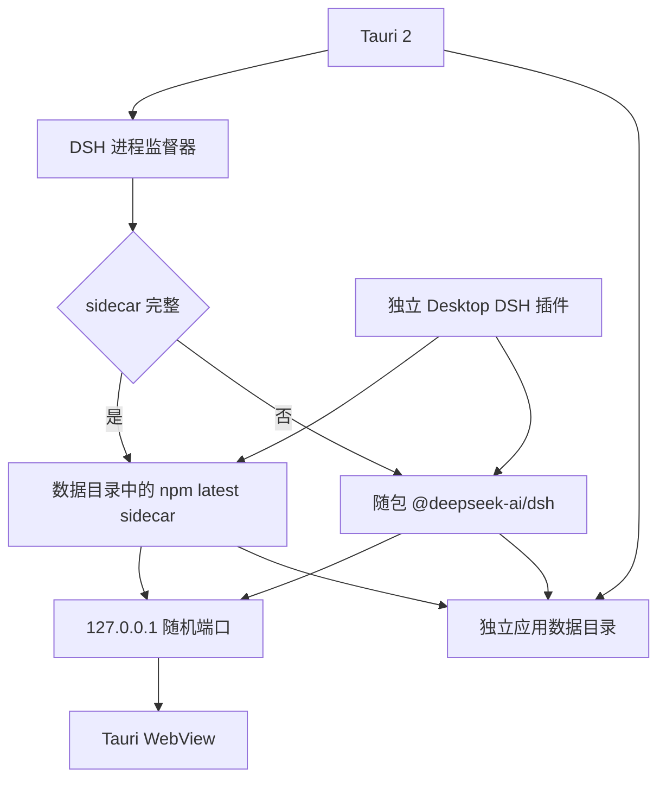

# 架构

## 不变量

1. 不 fork、不修改、不重新编译 `deepseek-ai/deepseek-harness` 源码。
2. DSH 运行时来自官方 `@deepseek-ai/dsh` npm 发布物。
3. 安装包锁定一个出厂 DSH 精确版本，作为默认和回退点。用户可以把 sidecar 更新到官方 npm `latest`，不改安装包。
4. 新的 Agent 能力通过独立 DSH 插件接入。
5. 窗口、托盘、更新、Keychain 等操作系统能力由 Tauri 提供。

当前出厂版本为 `@deepseek-ai/dsh@0.1.0-rc.6`。检查更新读取 npm `@deepseek-ai/dsh` 的 `latest` dist-tag；比当前运行版本新、且随包 Node 满足 `engines` 时，允许安装。

## 运行结构



Tauri 启动 DSH 后轮询本地 HTTP 服务。服务可用时，主 WebView 从内置启动页导航到官方 Web UI。DSH 意外退出时，WebView 返回内置错误页，保留最近的子进程日志并允许重启。sidecar 在启动完成前失败时，监督器回退到上一份 sidecar 或随包版本再启。

主窗口默认隐藏。只有官方 Web UI 完成页面加载后才显示；内置页面只在启动失败、运行时退出或正在切换 DSH 时作为恢复界面出现。第二次启动由 Tauri 单实例插件转交给已有实例，不会再创建一套 DSH 进程。

## 开发与发行

开发模式优先使用准备好的本地运行时。缺少本地运行时时，回退命令为：

```sh
npx --yes @deepseek-ai/dsh@0.1.0-rc.6 web \
  --patch <generated-desktop-patch> \
  --host 127.0.0.1 \
  --port <available-port>
```

本地已经执行过 `npm run prepare:runtime` 时，开发模式优先直接使用 `src-tauri/resources/dsh-runtime`，不再把约数百 MB 的运行时复制到 `target/debug/resources`。开发版数据写入应用目录下的 `development` 子目录，与发行版隔离。缺少本地运行时时才回退到系统 `npx`。

发行模式启动不跑 `npx`。构建阶段安装锁定的官方 `@deepseek-ai/dsh`，并随 App 交付固定的 Node.js 22.23.2（含 npm）。监督器按 sidecar、随包运行时、系统 `npx` 的顺序查找。用户选择更新时，才用随包 npm 安装 npm `latest`。

这两条路径运行同一个官方 `lib/bin.js`，区别只在交付方式。sidecar 只替换 DSH 的 `app` 树，Node 仍用随包二进制。

## DSH sidecar 更新

检查更新读取 `https://registry.npmjs.org/@deepseek-ai/dsh/latest`，连不上再试 npmmirror。不跟 GitHub 兼容列表。可用 `DSH_DESKTOP_NPM_REGISTRY` 覆盖 registry。

安装用随包 Node 自带的 npm（开发回退则用系统 npm）执行 `npm install @deepseek-ai/dsh@<latest>`，写入 `{app_data}/runtimes/dsh/{version}/`。校验 `package.json` 版本和 `lib/bin.js` 后激活 sidecar 并重启。随包版本仍可从菜单恢复。只保留当前和上一份 sidecar。变更操作只走应用菜单；官方 Web UI 不能安装或切换。

菜单 **插件** 只处理用户装进 web profile 的 npm 包。添加和删除调用官方 `dsh plugin --profile web add|remove <spec>`。停用把该包 bundle 的顶层 id 写成 `{dsh_home}/desktop.user-plugins.patch.yml` 的 `disabled: true`，启动时叠在 `desktop.generated.patch.yml` 后面。已停用名单在 `{app_data}/user-plugins.json`。不改用户的 `cordis.patch.yml`。市场页只读 [DSH Hub](https://dsh-hub.cc/search?lang=zh) 的 `scope=verified` 目录，安装仍用详情里的 `manifest.name`，不跟 Hub 的 `github:` 钉死方案，也不装 Hub 自己的 DSH 插件。发行包没有 pnpm 时，用随包 Node 的 corepack 在 `{app_data}/bin` 放下 shim。

如果 npm latest 的 `engines.node` 超出随包 Node `22.23.2`，桌面端拒绝安装，提示先用菜单检查桌面更新。

数据目录：

- `{app_data}/runtimes/dsh/{version}/`：该版本的官方 `app` 树
- `{app_data}/runtime-state.json`：当前版本、上一版本、来源（`sidecar` / `bundled`）
- `{app_data}/bin/`：corepack 放下的 pnpm shim
- `{app_data}/user-plugins.json`：用户插件停用名单
- `{app_data}/dsh/desktop.user-plugins.patch.yml`：停用覆盖层

检查和安装在后台线程做，不堵住正在跑的 DSH。启动页只读展示版本和更新阶段。

## 桌面端更新

检查和安装走 `tauri-plugin-updater`，读取 GitHub Releases 的 `latest.json`。签名用项目自己的 updater 密钥，不是 Apple Developer ID / Windows Authenticode。请求超时 12 秒。代理优先 `DSH_DESKTOP_UPDATE_PROXY` 和环境变量，否则自动读系统 HTTPS/HTTP 代理（macOS 用 `scutil --proxy`）。只开 SOCKS、或 VPN 只劫持浏览器时仍可能连不上。

菜单在应用菜单：**检查桌面更新**、**安装并重启桌面更新**。和 DSH sidecar 更新共用 busy 锁与 toast，pending 分开。安装前先停 DSH 进程再替换安装包并重启。Linux 更新依赖 AppImage 产物。

数据目录（sidecar、插件、会话）随 `identifier` 保留，桌面更新不会清掉用户 sidecar。

## 插件边界

`src-tauri/resources/desktop-plugin/index.mjs` 是第一个独立 Host 插件。Tauri 在应用数据目录生成 Cordis patch，以绝对路径插入该插件。它不覆盖官方配置行，不修改官方包。

后续能力按以下边界实现：

| 能力 | 位置 |
| --- | --- |
| Agent 工具、业务服务、模型接缝 | DSH Host 插件 |
| 页面槽位、设置项、消息呈现 | DSH Client 插件 |
| 托盘、通知、Keychain、更新 | Tauri Rust |
| 同时依赖 UI 与系统能力 | Client 插件 + 最小 Tauri command |

官方 Web 页面不获得通用 Shell 或文件系统 Tauri 权限。需要原生能力时，只开放命名明确、参数受限的 command。

## 进程与数据

- DSH 绑定 `127.0.0.1`，端口由桌面端启动时选择。
- 发行版的 `DSH_HOME` 指向应用数据目录下的 `dsh`；开发版指向 `development/dsh`。
- npm 开发缓存位于应用缓存目录，避免污染运行数据。
- 默认 workspace 是应用数据目录下的空目录；用户可在官方 Web UI 中选择实际项目。
- 正常退出先向 DSH 进程组发送 `SIGTERM`，等待其插件树释放，再强制结束。
- 独立 runtime bootstrap 从 Node 启动起监测桌面父进程；Desktop 插件在运行树就绪后继续监测。桌面进程异常消失时 DSH 主动退出，避免留下孤儿进程。
- 启动诊断日志记录进程创建、HTTP 响应和 Web UI 导航的相对耗时。

## 升级规则

更换安装包出厂 DSH 版本，或用户安装 npm latest sidecar 后，应满足：

1. 官方 Web UI 可启动。
2. Desktop patch 可加载。
3. 新建会话和已有会话恢复正常。
4. DSH 崩溃后能返回启动页并重启。
5. App 退出后没有遗留 Node、npm 或 DSH 进程。

更换安装包出厂版本时，须同时修改锁定版本。
